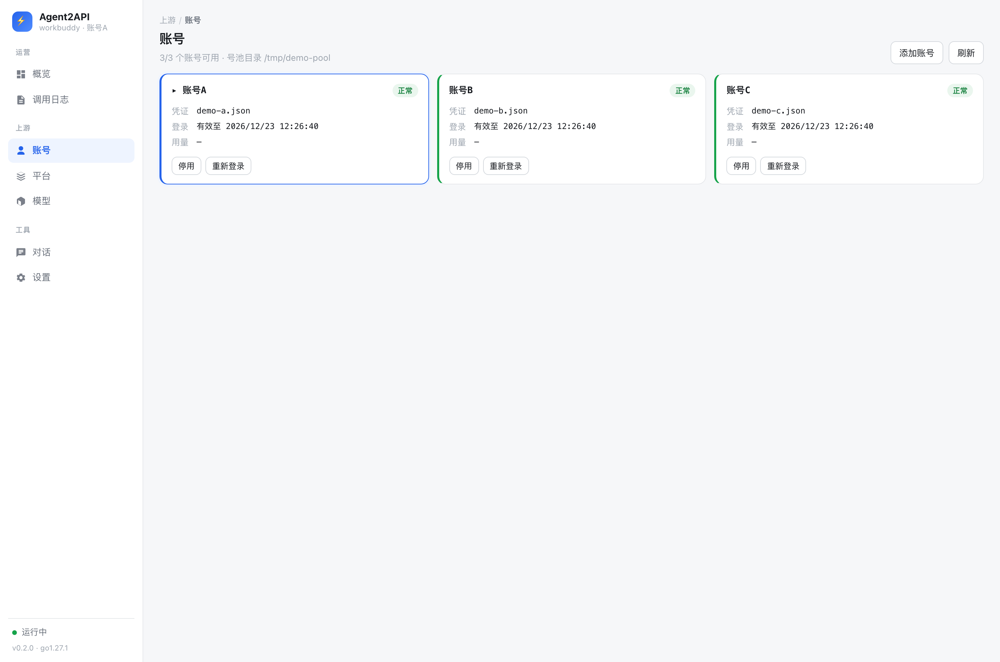

# Agent2API

把 AI Agent 平台的私有协议翻译成标准 LLM API 的本地反向代理网关。

已接入 **WorkBuddy / CodeBuddy**。对外提供 OpenAI Chat Completions、OpenAI Responses、Anthropic Messages 三种协议，Claude Code、Codex CLI 及任意 OpenAI/Anthropic 客户端**零改造**接入。

**简体中文** · [English](README.en.md) · [更新日志](CHANGELOG.md) · [免责声明](DISCLAIMER.md)

---

> [!WARNING]
> **个人学习与研究项目，非生产软件。** 仅供**本人已授权账号**在本机或私有环境自用，风险自担。
> 它会读取桌面客户端已登录的**凭证**（凭证 = 账号，切勿外传）；运作方式**可能不符合上游服务条款**。作者不鼓励也不支持商用或对外提供服务。

---

## 它解决什么问题

Claude Code、Codex CLI 这类客户端只认 OpenAI / Anthropic 标准协议，而各 AI Agent 平台的私有上游不提供标准接口 —— 于是你手上的平台额度，用不到那些好用的客户端里。

本项目在本机做一层协议翻译：不伪造协议，只把标准协议翻译成上游私有协议。

```
Claude Code / Codex / 任意 OpenAI 客户端
        │  /v1/chat/completions · /v1/responses · /v1/messages
        ▼
   ┌────────────────────────────────────────┐
   │  Agent2API                             │
   │  下游协议层 ── IR 层 ── 上游适配层      │
   └────────────────────────────────────────┘
        │  https://copilot.tencent.com/v2/chat/completions
        ▼
   WorkBuddy 上游
```

**核心特性**

- **三种协议一次做全**：Chat Completions / Responses / Anthropic Messages，均支持流式与非流式
- **思考过程**：上游 `delta.reasoning_content` → `reasoning_content` / `thinking` block / reasoning summary
- **工具调用**：原生 `tool_calls` 通道，含分片参数重组
- **凭证复用**：直接读桌面客户端已登录的凭证，无需重新登录
- **多账号号池**：额度不够用时把多个账号放进池子，按健康度自动调度、限流自动换号
- **内容脱敏**：规避上游关键词审核误伤（接 Claude Code / Codex 必需）
- **内置控制台**：`go:embed` 编进二进制，无前端构建步骤，中英文与亮暗主题

---

## 快速开始

```bash
# 方式一：直接安装（需 Go 1.23+）
go install github.com/576469377/Agent2API/cmd/agent2api@latest

# 方式二：从源码构建
git clone https://github.com/576469377/Agent2API && cd Agent2API
make build                     # 产出 bin/agent2api

agent2api                      # 启动，默认 127.0.0.1:8787
agent2api models               # 列出当前账号可用模型
```

**启动不需要任何配置**：它会自动探测本机桌面客户端的登录态。没装过桌面客户端时用 `agent2api login` 走设备码登录。

启动后命令行会打印控制台地址；浏览器打开即可管理。

> [!WARNING]
> **监听 `0.0.0.0` 且未设 `-api-key`，同网段任何人都能用你的账号额度。**

### 接入客户端

**Claude Code**

```bash
export ANTHROPIC_BASE_URL=http://127.0.0.1:8787
export ANTHROPIC_API_KEY=任意值     # 未配置网关密钥时不会校验
```

**Codex CLI**：base_url / API key 指向 `http://127.0.0.1:8787` 与任意值（走 `/v1/responses`）。

**任意 OpenAI SDK**：base_url 设为 `http://127.0.0.1:8787/v1`。

> [!TIP]
> 接 Claude Code / Codex 时**不要关闭脱敏**：它们的 system 模板含大量安全声明用语，会被上游审核误判拦截。

### 调用示例

```bash
curl http://127.0.0.1:8787/v1/chat/completions \
  -H "Content-Type: application/json" \
  -d '{"model":"deepseek-v4-flash","messages":[{"role":"user","content":"你好"}]}'

curl http://127.0.0.1:8787/v1/messages \
  -H "Content-Type: application/json" -H "anthropic-version: 2023-06-01" \
  -d '{"model":"deepseek-v4-flash","max_tokens":1024,"messages":[{"role":"user","content":"你好"}]}'

curl http://127.0.0.1:8787/v1/responses \
  -H "Content-Type: application/json" \
  -d '{"model":"deepseek-v4-flash","input":"你好"}'
```

---

## 网页控制台

`go:embed` 编进二进制，无前端构建、无 CDN 依赖，原生 SVG 图表。访问 `http://127.0.0.1:8787`：

| 页面 | 内容 |
|---|---|
| **概览** | 状态墙、请求趋势、Token 消耗、协议/模型/**账号**排行；带倒计时的自动刷新 |
| **账号** | 号池管理：调度状态、登录状态与凭证有效期、**每账号用量**；启停、清除冷却、重新登录、添加账号 |
| **对话** | 直接与网关对话，验证协议与模型表现；支持表格与公式渲染 |
| **平台** | 上游地址、账号数、模型数、健康状态 |
| **模型** | 模型清单与能力标签；可切换**账号 × 模型矩阵** |
| **调用日志** | 最近 200 条请求（含实际使用的账号），失败行高亮 |
| **设置** | 脱敏开关（热更新）、重新拉取模型清单、访问密钥、当前生效配置 |



> 截图中的账号均为演示数据，不含真实账号信息。仅**公式渲染**会在首次遇到数学公式时按需从 CDN 加载 KaTeX，离线时公式回退为等宽原文（加载失败后每 30s 重试一次），不影响其他功能。

---

## 多账号号池

一个账号额度不够用？把多个凭证放进号池目录，网关按健康度自动调度、限流自动换号。

```bash
agent2api login -out auths/account-a.json    # 逐个登录
agent2api login -out auths/account-b.json
agent2api -accounts-dir auths                 # 启动（工作目录有 auths/ 时自动启用）
```

也可以在控制台「账号」页直接**添加账号**（设备码登录），凭证自动落盘并通过**热加载**入池（每 10 秒扫描，无需重启）。

**调度语义**

| 情况 | 行为 |
|---|---|
| 调度 | 请求按账号**健康度**加权随机分发（成功率 EWMA×0.6 + 延迟 EWMA×0.4，连续失败降权；样本少时分数向中性收缩）——健康者更易被选中但不被独占，刚启动时等价均匀；另外**同一会话粘住同一账号**（`metadata.user_id` / `user` 字段识别会话），长上下文不在账号间漂移 |
| 限流（429） | 冷却**该账号上的该模型**并换号（同账号其他模型仍可用）；冷却时长解析上游文案里的精确重置时刻（如「将在 23:21:31 重置」）做到点解冻，解析失败按指数退避（10s 起、60s 基数、封顶 24h） |
| 鉴权失效（刷新后仍 401） | 冷却整个账号 10 分钟 |
| 参数错误（上下文超限等） | 直接失败 —— 换任何账号结果都一样 |
| 传输错误 / 5xx | 换号但不冷却（可能是全局抖动），带池级退避与抖动 |
| 全部冷却 | 返回 429 + **最早**解冻秒数；全部鉴权失效则返回 401（重试永远不会成功） |

**控制台里的账号管理**：每账号调度状态（▸ 标出下一个使用）、登录状态与凭证有效期、每账号用量（落盘持久化）；支持**停用/启用**（临时摘出调度）、**清除冷却**（上游提前恢复时手动解冻）、**重新登录**（掉线账号直接发起设备码登录，凭证写回原文件）。

> 桌面客户端凭证与号池文件可并存，账号卡片会标注来源。桌面客户端**下线不影响**网关运行 —— 凭证只是启动时读一次，后续刷新由网关自己完成。

---

## 支持的接口

| 接口 | 协议 | 流式 | 非流式 |
|---|:-:|:-:|:-:|
| `POST /v1/chat/completions` | OpenAI Chat Completions | ✅ | ✅ |
| `POST /v1/responses` | OpenAI Responses | ✅ | ✅ |
| `POST /v1/messages` | Anthropic Messages | ✅ | ✅ |
| `GET /v1/models` | 模型列表 | — | ✅ |
| `GET /health` | 健康检查 | — | ✅ |
| `GET /` | 网页控制台 | — | ✅ |

文本、思考过程、工具调用、多轮对话、系统提示词、采样参数、图片输入。

---

## 配置

优先级：命令行参数 > 环境变量 > 配置文件 > 内置默认。示例见 [`config.example.json`](config.example.json)。

> [!NOTE]
> `server.write_timeout_sec` 与 `log.level` / `log.format` 目前**不会被读取**（流式响应刻意不设写超时，日志级别/格式尚未实现），仅为向后兼容保留。

| 参数 | 环境变量 | 说明 |
|---|---|---|
| `-config` | — | 配置文件路径（JSON） |
| `-port` | `AGENT2API_PORT` | 监听端口，默认 8787 |
| `-host` | `AGENT2API_HOST` | 监听地址，默认 127.0.0.1 |
| `-api-key` | `AGENT2API_API_KEY` | 网关访问密钥，为空则不鉴权 |
| `-credential` | `AGENT2API_CREDENTIAL_PATH` | 凭证文件路径，为空时自动探测 |
| `-accounts-dir` | — | 号池目录，目录下每个 `*.json` 视为一个账号 |
| `-base-url` | `AGENT2API_BASE_URL` | 上游地址 |
| `-metrics-file` | — | 指标落盘路径 |
| `-no-persist` | — | 关闭指标落盘 |
| `-no-sanitize` | — | 关闭内容脱敏 |
| `-platform` | — | 强制指定上游平台（当前仅 `workbuddy`；缺省自动探测，调试用） |

子命令：`agent2api`（启动）、`agent2api login`（设备码登录）、`agent2api models`（列出模型）、`agent2api dedupe`（清理凭证目录里的重复与无效凭证；默认只预览，加 `-yes` 实际删除，默认目录 `~/.workbuddy`，可用 `-dir` 指定其他目录）。

---

## 安全须知

1. **凭证来源**：网关不要求输入账号密码，而是读取本机桌面客户端**已登录**的凭证文件 —— 等价于把桌面端登录态借给本机进程。
2. **凭证文件 = 你的账号**：请勿拷贝到其他机器、勿提交进仓库。`.gitignore` 已忽略相关路径。
3. **默认只监听 `127.0.0.1`**：改为 `0.0.0.0` 且未设 `-api-key` 时，同网段任何人可消耗你的额度。共享环境必须设 `-api-key` 并在前置反向代理做鉴权。
4. **日志与指标**可能记录模型名与 token 数；`-no-persist` 可关闭落盘。

漏洞报告见 [SECURITY.md](SECURITY.md)。

---

## 架构

```
internal/
├── llm/          IR 层（零依赖）：请求/响应/错误的中间表示
├── adapter/      上游平台接缝：Adapter 接口
│   └── workbuddy/  WorkBuddy 实现：认证 / 请求 / SSE / 模型 / 脱敏
├── api/          下游协议编解码
│   ├── common/     SSE 写出、错误载荷（三协议共用）
│   ├── openai/chat/ · openai/responses/ · anthropic/messages/
├── app/          HTTP 路由与编排（hub：多平台运行时）
├── obs/          指标采集与持久化
├── web/          内置控制台（go:embed）
└── config/       配置
```

**设计要点**：`api/*` 与 `adapter/*` 互不 import，只通过 `internal/llm` 通信 —— 把「N 个平台 × M 个协议」的复杂度从 N×M 降为 N+M。接入新平台时，三个下游协议一行都不用改。

`Adapter` 接口只有 3 个方法（`Stream` / `ListModels` / `Name`），`ResponseStream` 只有 1 个方法（`Recv`），造假适配器做测试的成本极低。

详细设计见 [`docs/design/01-架构设计.md`](docs/design/01-架构设计.md)，上游协议逆向见 [`docs/research/02-WorkBuddy上游协议逆向.md`](docs/research/02-WorkBuddy上游协议逆向.md)。

---

## 测试

```bash
make check        # gofmt + go vet + go test
make cover        # 覆盖率
go test ./... -race
```

协议转换用**金帧回放**：脱敏后的真实上游样本存在 [`fixtures/`](fixtures/)，测试逐帧喂给解析器，断言产出的 **IR 事件序列**而非字节 —— 完全离线验证，不打真实上游。

当前 12 个包、123 个测试用例，`-race` 全绿。核心包覆盖率：`common` 94%、`obs` 94%、`llm` 89%、`adapter` 65%、`config` 58%、`app` 38%、`workbuddy` 55%。

---

## 已知限制

**设计限制**

- **上游不支持非流式请求**：非流式在代理侧聚合，首字延迟与流式一致
- **单进程单实例**：冷却状态在内存，多实例部署时各自独立冷却，会重复冲击上游
- **额度查询端点未实现**：上游该路由需企业版权限（403）
- **DSML 文本态工具调用兜底未实现**：实测上游走原生 `tool_calls`，如遇回退需补上
- **思考过程是单向的**：上游只随响应给出 `reasoning_content` 且不带签名 —— Anthropic `thinking` block 恒为 `"signature": ""`，assistant 的思考内容也不会重发给上游（多轮会话中上游每次重新推理）；若上游未来校验签名需再补

**其他行为**

- **指标持久化默认开启**：无配置文件时写到当前工作目录的 `agent2api-metrics.json`（含调用统计），已在 `.gitignore` 中，但**打包发布时需手动排除**
- **控制台的「添加账号」需要号池目录**：未配置时凭证写到 `~/.workbuddy`，配好 `-accounts-dir`（或建 `auths/`）后自动入池

---

## 路线图

- [ ] 号池熔断与额度查询
- [ ] 第二个平台适配器
- [ ] `cmd/probe` 协议漂移检测

---

## 贡献

欢迎 Issue 与 PR，先读 [CONTRIBUTING.md](CONTRIBUTING.md)。

> [!IMPORTANT]
> 提交 Issue 时**请勿粘贴真实凭证、token 或账号昵称**。

---

## 许可证

**尚未确定（TBD）** —— 仓库未附 LICENSE，默认保留所有权利。确定前请勿商用或再分发。

本项目为个人学习与技术研究项目，仅供本人已授权账号在本机或私有环境自用，风险自担。完整条款见 [DISCLAIMER.md](DISCLAIMER.md)。
